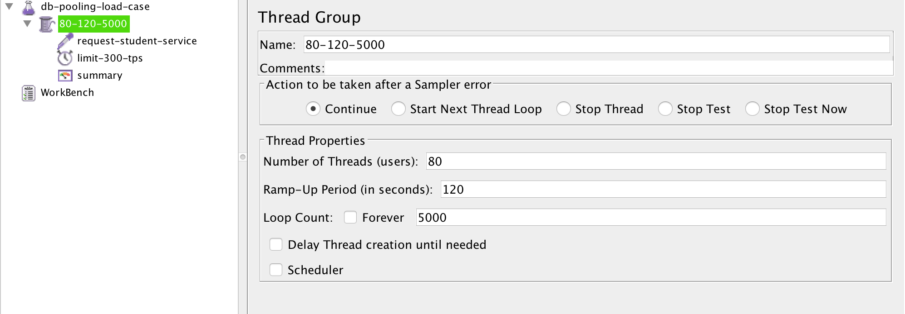
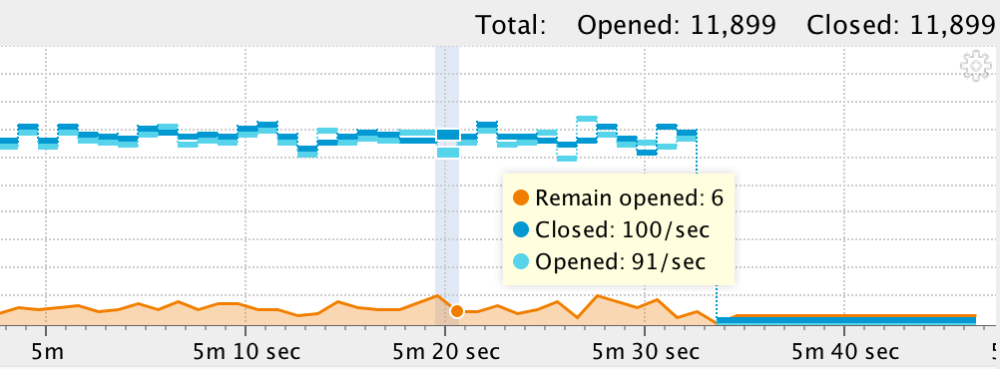
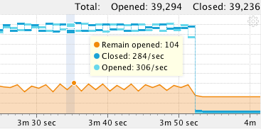
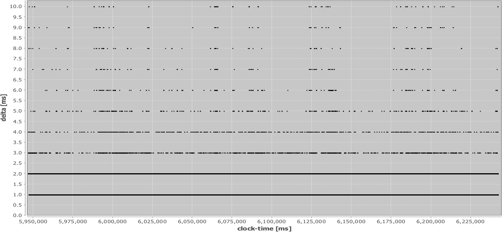
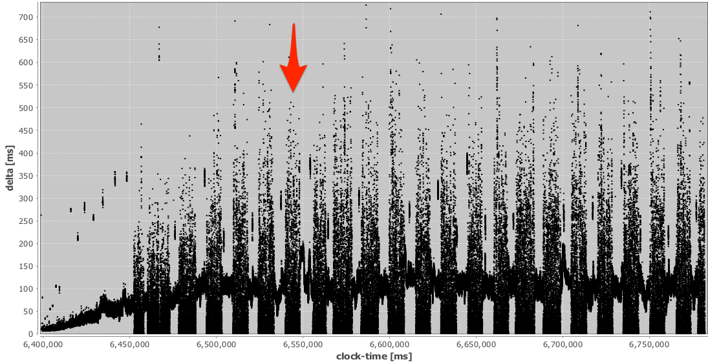
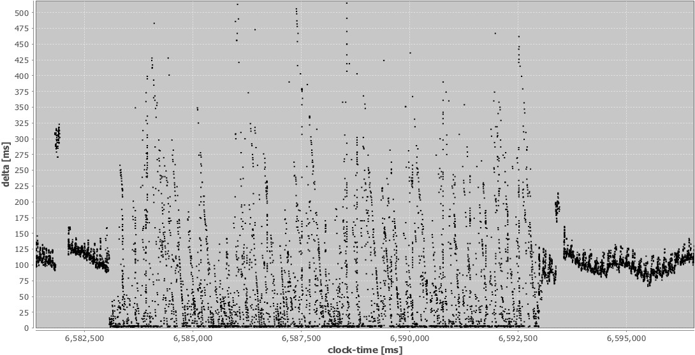
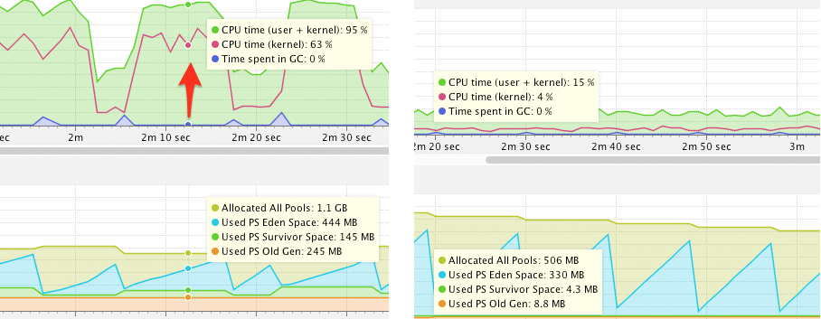

Missed Connections: Implications of Pooling
===========================================

[ [WTFP License](http://www.wtfpl.net) | [Improve this reference](http://github.com/joshrosso/octetz.com) | [View all references](../index.html) ]

---

{width="800"}

It's not tribal knowledge that DB connections are generally pooled.
Pooling connections can prevent the overhead of establishing a new
connection at the time a query needs to execute. Still today, I run into
situations where DB pooling was not considered in an application that
has high-performance requirements. So what are the **practical**
implications of pooling vs not-pooling connections to a database? Are we
talking trivial ms? In this post, let's see if we can get closer to the
answer with a data-driven approach.

Application architecture 
------------------------

In this example, we'll use a REST service that allows our mobile
applications to request lists of students in our university. As a
client, we'll leverage JMeter running on a dedicated box to act as load
in this use case. The following diagram describes architecture.

Figure 1: Test case architecture.

{width="500"}

Based on this architecture, we have the database configured to allow 150
parallel connections. We've also setup Jetty to include 100 available
threads. Ensuring the application can process 100 parallel requests at a
given time.

Application code 
----------------

All the application code used in these examples can be found at
<https://github.com/joshrosso/db-pooling-example>. The main branch
contains the pooled configuration and the [non-pooled-app
branch](https://github.com/JoshRosso/db-pooling-example/tree/non-pooled-app)
contains the code before pooling. I'll break down the code now, but you
may wish to visit the repository to check dependencies if you're coding
along.

Let's start by creating a JAX-RS service capable of providing a SQL
statement to another method that queries our database and provides a set
of results back.

StudentService.java - [View on
GitHub](https://github.com/JoshRosso/db-pooling-example/blob/non-pooled-app/src/main/java/com/joshrosso/StudentService.java)

```java
private static final Logger logger = LogManager.getLogger(StudentService.class.getName());
private static final Gson mapper = new Gson();
private static final String RUN_ID = "static";

@GET
@Produces(MediaType.APPLICATION_JSON)
public Response retrieveStudents() throws Exception {
    String corrId = UUID.randomUUID().toString();
    logger.trace(String.format("%d %s %s %s", System.currentTimeMillis(), "start_retrieveData", corrId,  RUN_ID));
    List<Map<String,Object>> students = DataRetriever.retrieveData("SELECT * FROM university.students;");
    logger.trace(String.format("%d %s %s %s", System.currentTimeMillis(), "end_retrieveData", corrId,  RUN_ID));
    String response = mapper.toJson(students);
    return Response.status(200).entity(response).build();
}
```

Based on the above implementation, we will retrieve data from the static
method `retrieveData` inside of our `DataRetriever` class. We'll return
JSON to the client by marshalling the datastruture with GSON. Lastly,
we'll wrap the retrieval call in loggers that print time. These loggers
will provide us metrics on how long requests are spending within the
`retrieveData` method. We'll calculate this later by taking the delta of
`currentTimeMillis` for each unique pair of `corrId`.

Next let's implement `DataRetriever` to satisfy its caller above.

DataRetriever.java - [View on
GitHub](https://github.com/JoshRosso/db-pooling-example/blob/non-pooled-app/src/main/java/com/joshrosso/DataRetriever.java)

```java
private static final Logger logger = LogManager.getLogger(DataRetriever.class.getName());

private static final String JDBC_STRING = "jdbc:mysql://52.24.207.152/university?user=tester&password=tester";

public static List<Map<String, Object>> retrieveData(String sql) {
    List<Map<String,Object>> resultList = null;

    try (Connection conn = DriverManager.getConnection(JDBC_STRING);
         Statement stmt = conn.prepareStatement(sql)) {

         try (ResultSet rset = stmt.executeQuery(sql)) {

             resultList = parseResultSet(rset);

         } catch(SQLException ex) {
             logger.error("Query failed to execute. Exception: " + ex.getMessage());
         }

    } catch(SQLException ex) {
        logger.error("Could not prepare statement: " + ex.getMessage());
    }

    return resultList;
}
```

`DataRetriever` exhibits a fairly standard JDBC-query interaction. Take
note that for now, we'll get a new connection from `DriverManager` each
time we wish to run a query.

`retrieveData` relies on `parseResultSet` to create the appropriate
datastrure before closing the `ResultSet`. This method is shown below.

DataRetriever.java - [View on
GitHub](https://github.com/JoshRosso/db-pooling-example/blob/non-pooled-app/src/main/java/com/joshrosso/DataRetriever.java)

```java
private static List<Map<String,Object>> parseResultSet(ResultSet rset) throws SQLException {
    List<Map<String,Object>> resultList = new ArrayList<>();
    ResultSetMetaData rsMeta = rset.getMetaData();
    int numOfCol = rsMeta.getColumnCount();

    while(rset.next()) {
        Map<String,Object> row = new HashMap<>();
        for(int i = 1; i <= numOfCol; i++) {
            row.put(rsMeta.getColumnName(i), rset.getObject(i));
        }
        resultList.add(row);
    }

    return resultList;
}
```

We now have a service layer setup to handle the retrieval and
transformation of our data. Let's put a HTTP server in front of it to
act as the inbound endpoint to the service.

DataRetriever.java - [View on
GitHub](https://github.com/JoshRosso/db-pooling-example/blob/non-pooled-app/src/main/java/com/joshrosso/RestServer.java)

```java
public static void main(String[] args) throws Exception {
    ServletContextHandler context = new ServletContextHandler(ServletContextHandler.SESSIONS);
    context.setContextPath("/");

    Server server = new Server(8001);
    server.setHandler(context);
    server.setThreadPool(new ExecutorThreadPool(100, 1000, 30000));

    ServletHolder jerseyServlet = context.addServlet(ServletContainer.class, "/*");
    jerseyServlet.setInitOrder(0);

    jerseyServlet.setInitParameter("jersey.config.server.provider.classnames",
            StudentService.class.getCanonicalName());

    try { server.start(); server.join(); }
    finally { server.destroy(); }
}
```

Here we have a Jetty server bootstrapped to hook into our JAX-RS
service. Note the server has been configured with an
[ExecutorThreadPool](http://download.eclipse.org/jetty/7.6.17.v20150415/apidocs/org/eclipse/jetty/util/thread/ExecutorThreadPool.html#ExecutorThreadPool(int,%20int,%20long))
set to `100` idle threads with the ability to expand upwards of `1000`
threads if needed. Since our focus is DB connection pooling, we want to
ensure the Jetty server is not the bottleneck.

Now we're ready to package the application up as a runnable JAR. For the
following test cases, I simply pipe the logger outputs to a file that
I'll parse later.

Test case config 
----------------

The test case used in this post will be created in JMeter. We'll start
off with a threadgroup of 80 users and a ramp-up time of 2 minutes.
We'll also set an upper bounds on how many requests can be made. For the
first test case I'll often overwrite this and stop at 100,000 requests.

Figure 2: JMeter test case / load profile.


{width="800"}


In our first round of test cases, we'll attempt to push the total
throughput up to 300 tps. The test case will be tweaked as we progress,
but our first set of tests will use the configuration above.


Non-Pooled Performance (80 User - 300 tps) 
------------------------------------------


The following JMeter output resulted approximately 100,000 completed
requests. Each `summary +` line shows a new 30 second average and each
`summary =` line shows the cumulative average (including wrap-up time).


Figure 3: JMeter Results: Left-right: \[total reqs, total time, tps, avg
resp time, min resp time, max resp time, …​\]


```java
summary +   2908 in    30s =   96.9/s Avg:   828 Min:   692 Max:  1928 Err:     0 (0.00%) Active: 80 Started: 80 Finished: 0
summary =  95019 in  1024s =   92.8/s Avg:   811 Min:   692 Max:  7968 Err:     0 (0.00%)
summary +   2963 in    30s =   98.8/s Avg:   809 Min:   692 Max:  2462 Err:     0 (0.00%) Active: 80 Started: 80 Finished: 0
summary =  97982 in  1054s =   93.0/s Avg:   811 Min:   692 Max:  7968 Err:     0 (0.00%)
summary +   2976 in    30s =   99.2/s Avg:   804 Min:   692 Max:  1133 Err:     0 (0.00%) Active: 80 Started: 80 Finished: 0
summary = 100958 in  1084s =   93.1/s Avg:   811 Min:   692 Max:  7968 Err:     0 (0.00%)
```

We've clearly struggled to get anywhere near the 300tps limit. We
averaged approximately an 810ms response time and our throughput was
closer to 95tps. Let's now take a look at our log data from a time
series.

Figure 4: Time spent in DB query retrieval | non-pooled-300tps | 810ms
avg

{width="800"}

> How to read the time series: The time series graphs throughout this post show the clock time of the test across the x-axis and the time spent completing the DB query as the y-axis. For every total time it takes to satisfy a response, you see a black dot placed on the time series graph. These data points are driven by the loggers configured in the application.

There is clearly a banding pattern here with multiple, somewhat
consistent, spikes moving through vertically. The results appear
consistent with what we're seeing in JMeter. The average time of all our
logger data points were reported as 810ms. Let's zoom into this banding
pattern and take a close look.


Figure 5: Time spent in DB query retrieval (zoomed) | non-pooled-300tps
| 810ms avg


{width="800"}


Here the banding is quite clear. We have some fairly similar times spent
running the load over time and can once again see the spikes interjected
throughout the test. Let's now implement connection pooling and compare
results.


Implementing Connection Pooling 
-------------------------------


To implement pooling in the application, we'll start by importing
[Apache DBCP2](https://commons.apache.org/proper/commons-dbcp). DBCP2
provides us connection pooling along with a plethora of configuration
options. Let's start by adding a datasource setup method to
`DataRetriever.java`.


DataRetriever.java - [View on
GitHub](https://github.com/JoshRosso/db-pooling-example/tree/master/src/main/java/com/joshrosso/DataRetriever.java)


```java
public static DataSource setupDataSource(String connectURI) {
    BasicDataSource ds = new BasicDataSource();
    ds.setDriverClassName("com.mysql.jdbc.Driver");
    ds.setUrl(connectURI);
    ds.setMaxIdle(60);
    ds.setMaxTotal(80);
    ds.setMinIdle(20);
    ds.setMaxWaitMillis(30000);
    return ds;
}
```


Here we'll setup the pool to contain upwards of 80 connections, allowing
60 max idle connections, and allowing 20 idle connections to remain
around until they are needed or become stale. We'll now store a instance
of `DataSource` returned by this method into our class. We'll also use
that instance of `DataSource` to provide our connections when needed.


DataRetriever.java - [View on
GitHub](https://github.com/JoshRosso/db-pooling-example/tree/master/src/main/java/com/joshrosso/DataRetriever.java)


```java
private static final DataSource dataSource =
    setupDataSource("jdbc:mysql://52.24.207.152/university?user=tester&password=tester");

public static List<Map<String, Object>> retrieveData(String sql) {

    List<Map<String,Object>> resultList = null;

    try (Connection conn = dataSource.getConnection();
         Statement stmt = conn.prepareStatement(sql)) {

    // additional code removed for brevity
```


Aside from the new data member `dataSource`, you can see in we're now
grabbing the connection directly from this member in the try block. Now
that we're leveraging connection pooling, let's rebuild the application
and run the same test case against it.


Pooled Performance (80 User - 300 tps) 
--------------------------------------


Figure 6: JMeter Results Pooled: Left-right: \[total reqs, total time,
tps, avg resp time, min resp time, max resp time, …​\]


```java
summary +   8988 in    30s =  299.6/s Avg:   179 Min:   139 Max:   216 Err:     0 (0.00%) Active: 80 Started: 80 Finished: 0
summary =  90479 in   343s =  263.6/s Avg:   175 Min:   139 Max:  3365 Err:     0 (0.00%)
summary +   8993 in    30s =  299.7/s Avg:   179 Min:   139 Max:   211 Err:     0 (0.00%) Active: 80 Started: 80 Finished: 0
summary =  99472 in   373s =  266.5/s Avg:   175 Min:   139 Max:  3365 Err:     0 (0.00%)
summary +   8985 in    30s =  299.5/s Avg:   179 Min:   139 Max:   213 Err:     0 (0.00%) Active: 80 Started: 80 Finished: 0
summary = 108457 in   403s =  269.0/s Avg:   175 Min:   139 Max:  3365 Err:     0 (0.00%)
```


After implementing pooling, the 300tps goal is achieved. Average
response times were around 178ms. This is a huge performance bump when
compared to [Figure 3](#figure-3). Let's now look towards the time
series to identify patterns.


Figure 7: Time spent in DB query retrieval | pooled-300tps | 171ms avg


{width="800"}


Related to the faster response times of this test, we can see many
requests spend below 200ms responding. Our median time spent was 171ms.
Around 1,900,000 clock time we also observe a large spike in latency.
It's hard to say the root cause of this with all the possible variables
(gc, network, etc). Let's now zoom into a chunk of our sub-200ms
responses.


Figure 8: Time spent in DB query retrieval (zoomed) | pooled-300tps |
171ms avg


{width="800"}


The zoomed series exhibits cleaner banding relative to [Figure
5](#figure-5). This is the pattern I'd expect to observe from a pooled
database connection. A very important observation here is we do **not**
exhibit the constant spiking you see throughout our non-pooled test. See
[Figure 4](#figure-4) and [5](#figure-5) for a reminder on the spiking
observation. It'd be interesting to quickly check how the JVM is
handling this load. Let's do that now.


Profiling the applications 
--------------------------


We'll now hookup YourKit to get a better understanding of how the two
application variations behave under load. Let's start by analyzing how
our non-pooled test case's heap responds.

> The following snapshots were be done on separate test instance as attaching a profiler to the above tests would have skewed the data.

Figure 9: Heap allocation of non-pooled app


{width="600"}


There is a clear sawtooth pattern to our eden space that is incurring
garbage collection every few seconds. As the old gen space grows, we can
see the saw tooth pattern become larger and require the heap to allocate
additional space.


Let's now look to the db connections and validate the behavior is
as-expected.


Figure 10: DB connection behavior of non-pooled app


{width="600"}


Remembering that our throughput in the non-pooled use case was around
95tps, we can see a close/open rate of close to 100. Most important to
us is the remain opened category. We see a constant fluctuation here
showing that at any given time, we aren't reusing connections we had
already established. At the end of the graph, when the load box was
killed, you can see our remained open connections drop to 0.


Let's now take a look at the heap behavior from the pooled test case.


Figure 11: Heap allocation of pooled app


{width="700"}


The pooled case exhibits very different behavior from the heap's
perspective. First, our eden space exhibits a more consistent pattern
throughout the GC cycle. Also worth mentioning is the old gen space
stays consistent around 21mb until test end. The impact of these results
show that our heap shrinks in size rather than growing.


Opening up the database connections again, we see the following.


Figure 12: DB connection behavior of pooled app


{width="400"}


On a technical level, we'll still see an open/close rate correlating to
our throughput. Now we will observe the important details that
connections are being pooled. In fact, a little after 3 minutes and 50
seconds, you can observe the load stopping and a number of connections
remaining open.


Granted, none of this is rocket science. Clearly the constant creation
and de-referencing of connection objects will have a large impact on our
heap in high-throughput scenarios. At this point it's just another
observation to be made on what could be defining our non-pooled pattern
from [Figures 4](#figure-4) and [5](figure-5). I'm not satisfied with
the clarity in the non-pooled results. Interestingly, in both test
cases, I'm beginning to wonder if the network itself could be producing
a lot of statistical noise. This begs the following question. **What
impact would merging availability zones have on our time series?**


Merged availability zone performance (100 User - 700 tps) 
---------------------------------------------------------


Let's now make a change to our architecture and test case. In the second
round of testing, we'll increase our user count to 100 users and push
for 700tps. Additionally, let's move our database server into the same
availability zone as our application server. Our new architecture is as
follows.


{width="500"}

Let's begin by testing the pooled scenario. After running approximately
200,000 requests through, we end up with the following results.

Figure 13: JMeter results | pooled - 700tps | left→right: \[total reqs,
total time, tps, avg resp time, min resp time, max resp time, …​\]

```java
summary = 162411 in 234s = 694.8/s Avg: 2 Min: 2 Max: 614 Err: 0 (0.00%)
summary +  20983 in  30s = 699.5/s Avg: 2 Min: 2 Max:  30 Err: 0 (0.00%) Active: 100 Started: 100 Finished: 0
summary = 183394 in 264s = 695.3/s Avg: 2 Min: 2 Max: 614 Err: 0 (0.00%)
summary +  20982 in  30s = 699.3/s Avg: 2 Min: 2 Max:  19 Err: 0 (0.00%) Active: 100 Started: 100 Finished: 0
summary = 204376 in 294s = 695.7/s Avg: 2 Min: 2 Max: 614 Err: 0 (0.00%)
```


With the move into the same availability zone, our DB call is now
blazing fast. We're easily achieving the 700tps limit and the mean
response time is 2ms from the JMeter perspective.


Let's take a quick look at the time series and histogram of these
results.


Figure 14: Time spent in DB query retrieval | pooled-700tps | 1ms avg


{width="800"}


Figure 15: Time spent in DB query retrieval - histogram | pooled-700tps
| 1ms avg


{width="800"}

> How to read the histogram: The graph above shows the time a bucket/category of time a request spent in the x-axis and the y-axis displays the number of entries that exist in that bucket. For example, the graph above shows 130,000 requests took 1 millisecond.

These graphs display lightning fast speed. Specifically from the
histogram perspective, we can see that requests above 3ms are very much
the exception. The mean time spent getting database results is reported
as 1ms.

After running the non-pooled scenario, we can see a difference in
results from JMeter.

Figure 16: JMeter results | non-pooled - 700tps | left→right: \[total
reqs, total time, tps, avg resp time, min resp time, max resp time, …​\]

```
summary = 178979 in   322s =  556.2/s Avg:   121 Min:     5 Max:  1093 Err:     0 (0.00%)
summary +  17045 in    30s =  568.2/s Avg:   142 Min:     5 Max:   752 Err:     0 (0.00%) Active: 100 Started: 100 Finished: 0
summary = 196024 in   352s =  557.3/s Avg:   123 Min:     5 Max:  1093 Err:     0 (0.00%)
summary +  16818 in    30s =  560.5/s Avg:   144 Min:     5 Max:  1268 Err:     0 (0.00%) Active: 100 Started: 100 Finished: 0
summary = 212842 in   382s =  557.5/s Avg:   125 Min:     5 Max:  1268 Err:     0 (0.00%)
```


We're no longer able to reach the 700tps limit. Throughput now reaches
560tps and mean response time has grown upwards of 144ms.


Let's examine our time spent in the retrieving data to see what impact
it had on the degradation.


Figure 17: Time spent in DB query retrieval | non-pooled-700tps | avg
not captured


{width="800"}


This shows a significantly different series than our [pooled
version](#figure-14)! I believe this pattern may have been buried in our
previous test with the additional network variability adding too much
noise. Very defined in this pattern are the pillars. Let's zoom into one
of the pillars, as identified by the arrow above, and see what's inside.


Figure 18: Time spent in DB query retrieval (zoomed) | non-pooled-700tps
| avg not captured


{width="800"}


Inside we observe a slanted-rain pattern. At first observation, it
almost looks like a lack of parallelism or a single threaded-ness
induced by the application. Yet this spike defined the slow speeding up
and then spike again, is in fact an implication of not pooling
connections. I've spent much time chasing this pattern in the past, and
time and time again after removing as many variables as possible, this
typically resurfaces.


When profiling this scenario we see similar heap behavior and looking at
the CPU a lot of kernel time being spent.


Figure 19: Profiler snapshot of CPU and memory utilization |
non-pooled-700tps


{width="800"}


I'd imagine the linux kernel is working hard constantly opening /
closing tcp connections to the database. It somehow recovers for a few
seconds in which user time is making the largest contribution. As time
goes on, it shows that these CPU spikes correlate directly to the
slanted rain pattern seen in each of the pillars seen in [Figure
17](#figure-17). Also, due to the constant GC on survivor and eden
space, we're spending about 10% of our processing time in GC every few
seconds.


Let's contrast this with a profiler snapshot of the pooled version.


Figure 20: Profiler snapshot of CPU and memory utilization |
pooled-700tps


{width="800"}


With the pooled application, we see significantly less usage of CPU from
the kernal. As we'd expect by removing the need to open and close as
many tcp connections. This allows us to place all processing power
required in the user usage. Essentially, our application. You'll also
notice the heap is taking up far less memory. Towards the end of the
test it shrunk to 100mb as memory stabilized from the initial spike.
You'll also observe that survivor and old gen space rarely grew, thus
didn't need to be collected. Since it's quite expensive to GC those
areas, relative to eden, we're benefiting by spending 0-1% of our total
time in GC at a given moment.


Summary 
-------


After all this work, we are at the same conclusion stated in paragraph
1. **DB can pooling provide massive gains to our application's
throughput capabilities**. Let's take a moment to review our before and
after:


Figure 21: Time series DB time - \[Non-pooled avg time: 45ms\] vs
\[Pooled avg time: 1ms\]


{width="800"}


Figure 22: Profiler CPU & Memory - \[Non-pooled\] vs \[Pooled\]


{width="800"}


We've seen a lot about potential patterns that present themselves in
applications when pooling was not considered appropriately. We've
observed impacts on response times and processing times. We've also
observed how the overall JVM can be affected by our pooling choices even
down to the strain on the Linux kernel! There is still a lot more to
investigate as some of the points in this post are simply loose
correlations from observable patterns. But for now they'll suffice and
strengthen the argument that DB pooling, or the lack there of, can
easily become the bottleneck in your overall application.

---

*Last updated: 10/12/2016*

[ [WTFP License](http://www.wtfpl.net) | [Improve this reference](http://github.com/joshrosso/octetz.com) | [View all references](../index.html) ]
