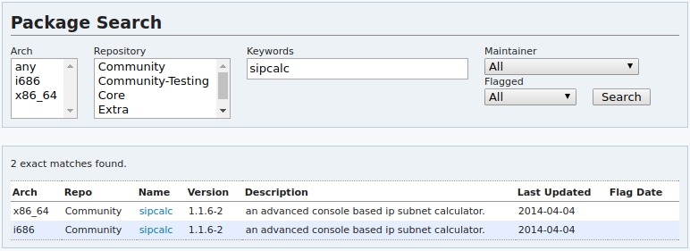
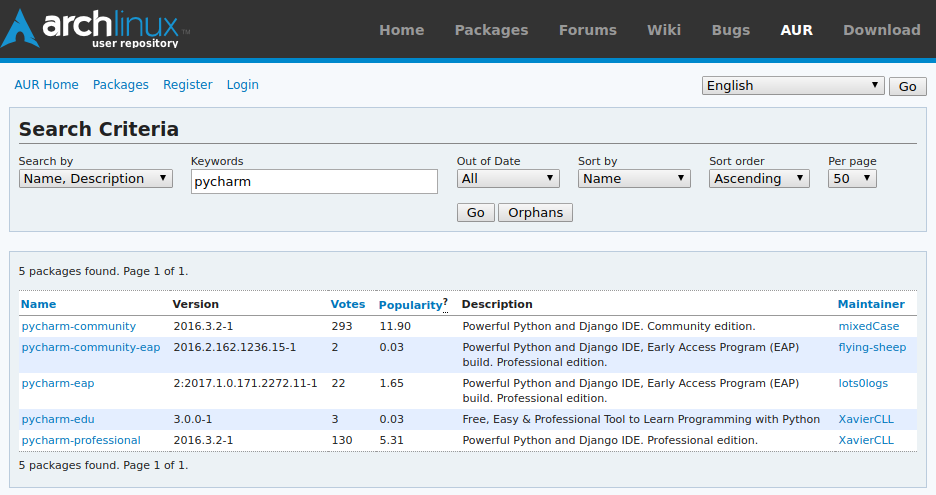
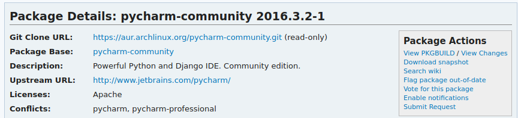

# Arch Linux Package Management: What you need to know

[ [WTFP License](http://www.wtfpl.net) | [Improve this reference](http://github.com/joshrosso/octetz.com) | [View all references](../index.html) ]

---

## Video

The video below is a live demonstration of the topics covered in this post.

<iframe width="800" height="400" src="https://www.youtube.com/embed/SckNg11n3MY" frameborder="0" allowfullscreen></iframe>

## Motivation

Last week I helped my roommate setup Arch Linux as his first Linux desktop. Explaining the various facets of package management brought me back to when I'd first learned Arch and was discovering the use of pacman, AUR, yaourt, and more. While there's no shortage of great documentation around all these topics, I felt a clean overview of key concepts critical to a new user would have made both of our lives easier.

## pacman

[pacman](https://wiki.archlinux.org/index.php/pacman) is Arch's package manager. Like any good package manager, it provides a consistent interface for downloading, installing, updating, and removing software on your system. It's generally considered best practice to ensure all software is managed by this single utility.

## Official repositories

Throughout your Arch journey, you'll be installing common packages maintained by [package maintainers](https://wiki.archlinux.org/index.php/Arch_terminology#Package_maintainer). Packages like `openssl`, `go`, and `nginx` are all readily available in official repositories. However, when you get to more specific packages, e.g. `intellij` and `matlab`, you'll need to look outside of the official repository, which will be covered later in this post.

Start by printing the `pacman` help options; get acquainted.

```bash
$ pacman -h

usage:  pacman <operation> [...]
operations:
    pacman {-h --help}
    pacman {-V --version}
    pacman {-D --database} <options> <package(s)>
    pacman {-F --files}    [options] [package(s)]
    pacman {-Q --query}    [options] [package(s)]
    pacman {-R --remove}   [options] <package(s)>
    pacman {-S --sync}     [options] [package(s)]
    pacman {-T --deptest}  [options] [package(s)]
    pacman {-U --upgrade}  [options] <file(s)>

use 'pacman {-h --help}' with an operation for available options
```

> The operation flags above have multiple options. You can get details on available flags by running an operation flag above and adding --help. e.g. `pacman -S --help`.

Next you'll update your local package database. `pacman` uses this database to know what repositories are available to search. Updating is not always required, but should be done every so often or after system upgrades. We'll use the `-S` flag representing a Sync operation. You'll also add a `-y` flag instructing that a new copy of the master package database is downloaded. You'll find a similar result can be achieved with the `-D` database operation.

```
$ pacman -Sy

:: Synchronizing package databases...
 core              123.2 KiB   188K/s  00:01 [###############################################] 100%
 extra             1722.0 KiB  1594K/s 00:01 [###############################################] 100%
 community         3.7 MiB     14.1M/s 00:00 [###############################################] 100%
 multilib-testing  1630.0B     0.00B/s 00:00 [###############################################] 100%
 multilib          185.9 KiB   30.3M/s 00:00 [###############################################] 100% 
```
> Each line represents an official repository that has been synchronized. Details on each official repository above can be found at https://wiki.archlinux.org/index.php/official_repositories.

Now you can install a package. Discovering whether a package is available can be done through `pacman` or through Arch package search at https://www.archlinux.org/packages. Let's search for the [sipcalc](http://www.routemeister.net/projects/sipcalc) package, used to calculate subnets. Using pacman you can add the `-s` flag, representing search, to the `-S` Sync operation.

```
$ pacman -Ss sipcalc

community/sipcalc 1.1.6-2
    an advanced console based ip subnet calculator.
```



> Equivalent search via the Arch package search.

Since the package is available, let's now install it using the `-S` Sync operation.

```bash
$ pacman -S sipcalc

resolving dependencies...
looking for conflicting packages...

Packages (1) sipcalc-1.1.6-2

Total Installed Size:  0.05 MiB

:: Proceed with installation? [Y/n] Y
(1/1) checking keys in keyring           [###############################################] 100%
(1/1) checking package integrity         [###############################################] 100%
(1/1) loading package files              [###############################################] 100%
(1/1) checking for file conflicts        [###############################################] 100%
(1/1) checking available disk space      [###############################################] 100%
:: Processing package changes...
(1/1) installing sipcalc                 [###############################################] 100%
```

> Based on the output, `pacman` not only installs the package, but also ensures any dependencies needed are downloaded and that no conflicting packages exist before installation.

Now `sipcalc` is installed and managed by `pacman`! You are now able to run the binary.

```
$ sipcalc 10.0.0.0/24

-[ipv4 : 10.0.0.0/24] - 0

[CIDR]
Host address    - 10.0.0.0
Host address (decimal)  - 167772160
Host address (hex)  - A000000
Network address   - 10.0.0.0
Network mask    - 255.255.255.0
Network mask (bits) - 24
Network mask (hex)  - FFFFFF00
Broadcast address - 10.0.0.255
Cisco wildcard    - 0.0.0.255
Addresses in network  - 256
Network range   - 10.0.0.0 - 10.0.0.255
Usable range    - 10.0.0.1 - 10.0.0.254
-
```

Since `pacman` is managing your packages, you can upgrade your system using the `-S` sync flag with `-y` for database refresh and `-u` for package update.

```bash
$ pacman -Syu
```

You can also remove `sipcalc` using `pacman`'s `-R` remove flag and the `-s` flag to remove unneeded dependencies.

```bash
$ pacman -Rs sipcalc
```

## User repositories

Eventually you'll find yourself needing a package that is not contained in an official Arch repository. Take Pycharm, Intellij's Python IDE, for example. If you head to Intellij's website, you'll find a Linux download of Pycharm that you can easily download and start. Yet you'd prefer to have `pacman` handle the package rather than have to manually maintain it.

```bash
$ pacman -Ss pycharm

<no results>
```

This is where the Arch User Repository (AUR) comes in. AUR lives at https://aur.archlinux.org and allows for the searching of packages. Packages in AUR are not maintained by selected, trusted, individuals as official repositories are. Yet you'll find comments and votes around packages hosted here to get insight on user's experience running them. In AUR, you can search for `pycharm`.



Select the package appropriate for you, in my case it will be [pycharm-community](https://aur.archlinux.org/packages/pycharm-community). There are a few methods to installing this package, I'm going to take the `git` approach. If you haven't, you'll need to install `git`. Good news is, [it's available in the official arch repository](https://www.archlinux.org/packages/extra/x86_64/git)! Find the `git` repository location and clone it to your machine.



> git location displayed as Git Clone URL.

```bash
$ cd /tmp

$ git clone https://aur.archlinux.org/pycharm-community.git

$ cd pycharm-community
```

Inside the pycharm-community directory, you'll find a PKGBUILD file. This file describes how the package is built by the `makepkg` command, which we'll use to build and install this package. Using the `makepkg` command and the `-s` to let `pacman` install missing dependencies and `-i` to install the package after it is built. 

```bash
$ makepkg -si
```

> You will not be allowed to run `makepkg` as root.

After the build completes and you answer all install prompts, Pycharm is now available on your system!

```bash
$ pycharm &>/dev/null &
```

> `&>/dev/null` sends all output (error and standard out) to /dev/null ensuring it does not flood your terminal. The final `&` returns you to your terminal rather than linking to the process where a `ctrl + c` would kill it. Alternatively, you could also launch the application through whatever GUI application launcher you use.

You'll also notice that while you did build and install the package using `makepkg`, `pacman` now manages it. You can verify this by doing a `-Q` query operation and `-s` to search for a specific package.

```bash
$ pacman -Qs pycharm

local/pycharm-community 2016.3.2-1
    Powerful Python and Django IDE. Community edition.
```

Through the same mechanism described previously, it can be removed.

```bash
$ pacman -Rs pycharm-community
```

## AUR helper: yaourt

The Arch community has built some impressive tooling on top of `pacman`. Specifically a tool named `yaourt` that extends the `pacman` features and has native AUR support. I personally don't use `yaourt`, but you may find it helpful to have unified tooling to install packages where you don't have to chase down where the package lives (AUR vs Official repo vs other). The `yaourt` install process is straight forward and can be found at https://archlinux.fr/yaourt-en. 

The `yaourt` commands are similar to those of `pacman`. For example, let's search for the `sipcalc` package, which we know lives in an official repository, and the `pycharm` package, which we know lives in AUR.

```bash
$ yaourt -Ss sipcalc

community/sipcalc 1.1.6-2 [installed]
    an advanced console based ip subnet calculator.
```

```bash
$ yaourt -Ss pycharm

aur/pycharm-community 2016.3.2-1 (293) (11.90)
    Powerful Python and Django IDE. Community edition.
aur/pycharm-community-eap 2016.2.162.1236.15-1 (2) (0.03)
    Powerful Python and Django IDE, Early Access Program (EAP) build. Professional edition.
aur/pycharm-eap 2:2017.1.0.171.2272.11-1 (22) (1.65)
    Powerful Python and Django IDE, Early Access Program (EAP) build. Professional edition.
aur/pycharm-edu 3.0.0-1 (3) (0.03)
    Free, Easy & Professional Tool to Learn Programming with Python
aur/pycharm-professional 2016.3.2-1 (130) (5.31)
    Powerful Python and Django IDE. Professional edition.
```

Installation of AUR based packages no longer require the `git` and `makepkg` steps. Now you can simply run the `yaourt` install command (identical to `pacman`'s).

```bash
$ yaourt -S pycharm-community

pycharm-community 2016.3.2-1  (2016-12-30 20:46)
( Unsupported package: Potentially dangerous ! )
==> Edit PKGBUILD ? [Y/n] ("A" to abort)
==> ------------------------------------
==> n
```

> Since this is an AUR package, you're warned that it is unsupported. You may still wish to visit the AUR website to validate that the package works based on votes and comments of other users.

## What's next

Once you're grokking these key ideas and looking to dive deeper, consider the following resources that go in greater depth around Arch package management with `pacman`.

- [Arch Wiki: pacman](https://wiki.archlinux.org/index.php/pacman)
  - Detailed documentation on pacman usage.
- [Digital Ocean: How to Use Arch Linux Package Management](https://www.digitalocean.com/community/tutorials/how-to-use-arch-linux-package-management)
  - A detailed walkthrough of `pacman` usage.
- [Digital Ocean: How To Use Yaourt to Easily Download Arch Linux Community Packages](https://www.digitalocean.com/community/tutorials/how-to-use-yaourt-to-easily-download-arch-linux-community-packages)
  - A detailed walkthrough of `yaourt` usage for working with packages from the Arch User Repository.


---

*Last updated: 01/14/2017*

[ [WTFP License](http://www.wtfpl.net) | [Improve this reference](http://github.com/joshrosso/octetz.com) | [View all references](../index.html) ]
